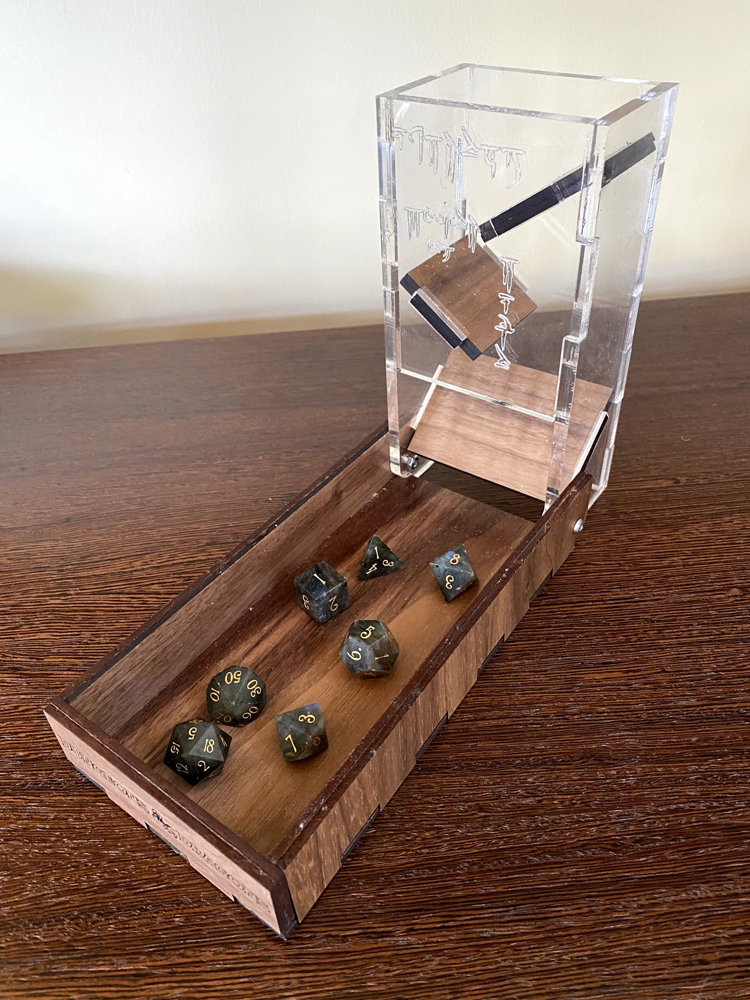

# Folding Dice Tower

This is a lasercut dice rolling tower, which folds down for storage. The vertical tower walls
are made from 6mm acrylic, and the base is made from 6mm wood (but feel free to use
whatever materials you like!).

